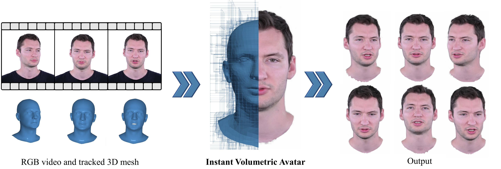

<h2 align="center"><b>INSTA - Instant Volumetric Head Avatars</b></h2>

<h4 align="center"><b><a href="https://zielon.github.io/" target="_blank">Wojciech Zielonka</a>, <a href="https://sites.google.com/site/bolkartt/" target="_blank">Timo Bolkart</a>, <a href="https://justusthies.github.io/" target="_blank">Justus Thies</a></b></h4>

<h6 align="center"><i>Max Planck Institute for Intelligent Systems, Tübingen, Germany</i></h6>

<h4 align="center">
<a href="https://youtu.be/HOgaeWTih7Q" target="_blank">Video&nbsp</a>
<a href="https://arxiv.org/pdf/2211.12499.pdf" target="_blank">Paper&nbsp</a>
<a href="https://zielon.github.io/insta/" target="_blank">Project Website&nbsp</a>
</h4>

<div align="center"> 

<i style="font-size: 1.05em;">Official Repository for CVPR 2023 paper Instant Volumetric Head Avatars</i>
</div>

### Installation

The repository is based on instant-ngp

### How To Use

### Dataset and Training

### Citation
If you use this project in your research please cite INSTA:
```bibtex
@proceedings{INSTA:CVPR2023,
  author = {Zielonka, Wojciech and Bolkart, Timo and Thies, Justus},
  title = {Instant Volumetric Head Avatars},
  journal = {Conference on Computer Vision and Pattern Recognition},
  year = {2023}
}
```