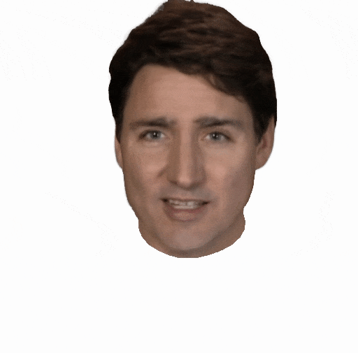
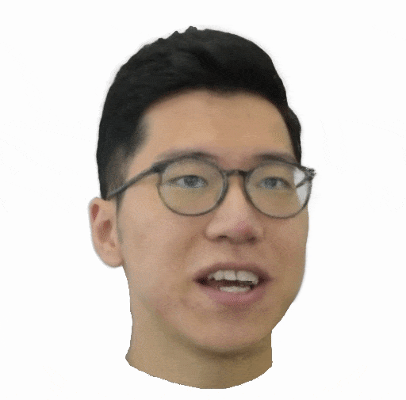
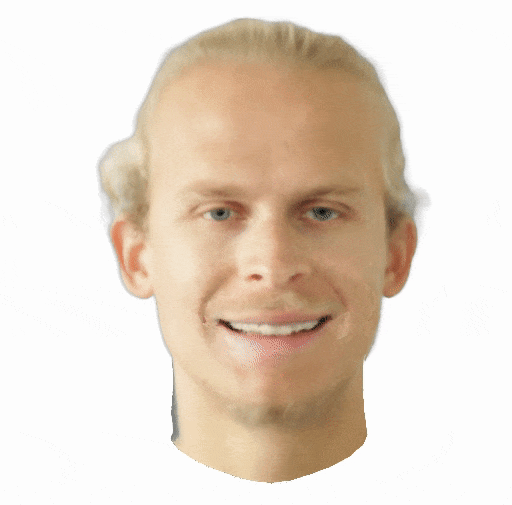
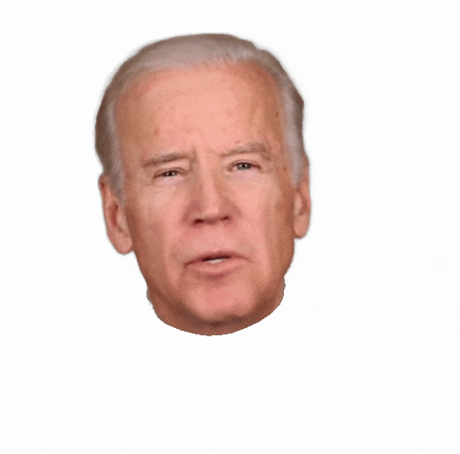
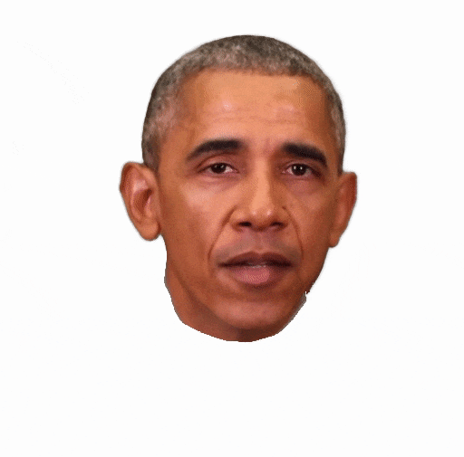
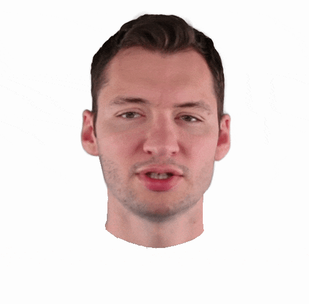
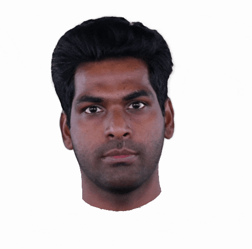
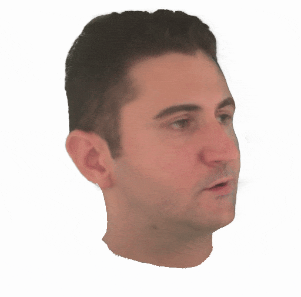

<h2 align="center"><b>INSTA - Instant Volumetric Head Avatars</b></h2>

<h4 align="center"><b><a href="https://zielon.github.io/" target="_blank">Wojciech Zielonka</a>, <a href="https://sites.google.com/site/bolkartt/" target="_blank">Timo Bolkart</a>, <a href="https://justusthies.github.io/" target="_blank">Justus Thies</a></b></h4>

<h6 align="center"><i>Max Planck Institute for Intelligent Systems, Tübingen, Germany</i></h6>

<h4 align="center">
<a href="https://youtu.be/HOgaeWTih7Q" target="_blank">Video&nbsp</a>
<a href="https://arxiv.org/pdf/2211.12499v2.pdf" target="_blank">Paper&nbsp</a>
<a href="https://zielon.github.io/insta/" target="_blank">Project Website&nbsp</a>
<a href="#dataset-and-training"><b>Dataset&nbsp</b></a>
<a href="https://github.com/Zielon/metrical-tracker" target="_blank">Face Tracker&nbsp</a>
<a href="https://github.com/Zielon/INSTA-pytorch" target="_blank">INSTA Pytorch&nbsp</a>
<a href="mailto:&#105;&#110;&#115;&#116;&#97;&#64;&#116;&#117;&#101;&#46;&#109;&#112;&#103;&#46;&#100;&#101;">Email</a>
</h4>

<div align="center"> 

<br>
<i style="font-size: 1.05em;">Official Repository for CVPR 2023 paper Instant Volumetric Head Avatars</i>
</div>
<br>

This repository is based on [instant-ngp](https://github.com/NVlabs/instant-ngp), some of the features of the original code are not available in this work.

<div align="center"> 
&#x26A0 We also prepared a Pytorch demo version of the project <a href="https://github.com/Zielon/INSTA-pytorch" target="_blank">INSTA Pytorch&nbsp</a> &#x26A0
</div>

### Installation

The repository is based on `instant-ngp` [commit](https://github.com/NVlabs/instant-ngp/tree/e7631da9fca9d0f3467f826fccd7a5849b3f6309). The requirements for the installation are the same, therefore please follow the [guide](https://github.com/NVlabs/instant-ngp#building-instant-ngp-windows--linux).
Remember to use the `--recursive` option during cloning.

```shell
git clone --recursive https://github.com/Zielon/INSTA.git
cd INSTA
cmake . -B build
cmake --build build --config RelWithDebInfo -j
```

### Usage and Requirements

After building the project you can either start training an avatar from scratch or load a snapshot. For training, we recommend a graphics card higher or equal to `RTX3090 24GB` and `32 GB` of RAM memory. Training on a different hardware probably requires adjusting options in the config:
```shell
  "max_cached_bvh": 4000,            # How many BVH data structures are cached
  "max_images_gpu": 1700,            # How many frames are loaded to GPU. Adjust for a given GPU memory size.
  "use_dataset_cache": true,         # Load images to RAM memory
  "max_steps": 33000,                # Max training steps after which test sequence will be recorded
  "render_novel_trajectory": false,  # Dumps additional camera trajectories after max steps
  "render_from_snapshot": false      # For --no-gui option to directly render sequences
```
Rendering from a snapshot does not require a high-end GPU and can be performed even on a laptop. We have tested it on `RTX 3080 8GB` laptop version. For `--no-gui` option you can train and load snapshot for rendering by using the config in the same way as the one with `GUI`.
The viewer options are the same as in the case of [instant-ngp](https://github.com/NVlabs/instant-ngp#keyboard-shortcuts-and-recommended-controls), with some additional key `F` to raycast the FLAME mesh.

Usage example

```shell
# Run without GUI examples script
./run.sh

# Run cross reenactment based on deformation gradient transfer
./run_transfer.sh

# Training with GUI
./build/rta --config insta.json --scene data/obama --height 512 --width 512

# Loading from a checkpoint
./build/rta --config insta.json --scene data/obama/transforms_test.json --snapshot data/obama/snapshot.msgpack
```

<div align="center"> 

<br>
<i style="font-size: 1.05em;">For better visualization you can use our GUI application.</i>
</div>
<br>

### Dataset and Training

We are releasing part of our dataset together with publicly available preprocessed avatars from [NHA](https://github.com/philgras/neural-head-avatars), [NeRFace](https://github.com/gafniguy/4D-Facial-Avatars) and [IMAvatar](https://github.com/zhengyuf/IMavatar). Each participant whose data was recorded in this study provided written consent for its release by signing this [document](./documents/Consent_general_english_ncs_video.pdf). Access to those sequences can be requested via [Google Forms](https://docs.google.com/forms/d/e/1FAIpQLSecX-7Arzv_qVQWFdicNxcxmPmSQx46y6TxnBBN67m0hvkXiA/viewform?usp=sharing&ouid=114977764432146378365).

The output of the training (**Record Video** in menu), including rendered frames, checkpoint, etc will be saved in the `./data/{actor}/experiments/{config}/debug`.
After the specified number of max steps, the program will automatically either render frames using novel cameras (`All` option in GUI and `render_novel_trajectory` in config) or only the currently selected one in `Mode`, by default `Overlay\Test`.

[Available avatars](https://drive.google.com/drive/folders/1LsVvr7PPwGlyK0qiTuDVUz4ihreHJgut?usp=sharing). Click the selected avatar to download the training dataset and the checkpoint. The avatars have to be placed in the `data` folder.
<div align="center" dis>
    <table class="images" width="100%"  style="border:0px solid white; width:100%;">
        <tr style="border: 0px;">
            <td style="border: 0px;"><a href="https://drive.google.com/file/d/1fUs_TkPE5dxuostXafBPIOnoGBGWMWdr/view?usp=sharing"></a></td>
            <td style="border: 0px;"><a href="https://drive.google.com/file/d/1OVMab86QiGJsXFK90owZ-Pnv1kxPn83v/view?usp=sharing"></a></td>
            <td style="border: 0px;"><a href="https://drive.google.com/file/d/1egl1Rg6b75T3hiuxFlkNZGfW745Fo0SZ/view?usp=sharing"></a></td>
            <td style="border: 0px;"><a href="https://drive.google.com/file/d/1RFsuzjfuZvUvhE2rrR-et41s7-6ZTRt0/view?usp=sharing"></a></td>
            <td style="border: 0px;"><a href="https://drive.google.com/file/d/1xHiDH_B2Qv0a5wgrieD1WmoxBnOfuw9u/view?usp=sharing"></a></td>
        </tr>
    </table>
    <table class="images" width="100%"  style="border:0px solid white; width:100%;">
        <tr style="border: 0px;">
            <td style="border: 0px;"><a href="https://drive.google.com/file/d/19clpdq6eQ4kcD9ndjrANu8q0iW774LYR/view?usp=sharing"></a></td>
            <td style="border: 0px;"><a href="https://docs.google.com/forms/d/e/1FAIpQLSecX-7Arzv_qVQWFdicNxcxmPmSQx46y6TxnBBN67m0hvkXiA/viewform?usp=sharing&ouid=114977764432146378365"></a></td>
            <td style="border: 0px;"><a href="https://docs.google.com/forms/d/e/1FAIpQLSecX-7Arzv_qVQWFdicNxcxmPmSQx46y6TxnBBN67m0hvkXiA/viewform?usp=sharing&ouid=114977764432146378365"></a></td>
            <td style="border: 0px;"><a href="https://docs.google.com/forms/d/e/1FAIpQLSecX-7Arzv_qVQWFdicNxcxmPmSQx46y6TxnBBN67m0hvkXiA/viewform?usp=sharing&ouid=114977764432146378365"></a></td>
            <td style="border: 0px;"><a href="https://drive.google.com/file/d/1ttoQfGfa3eRETc1uxLo4unjvxOiRzcCY/view?usp=sharing"></a></td>
        </tr>
    </table>
</div>

### Dataset Generation

For the input generation, a conda environment is needed, and a few other repositories. Simply run `install.sh` from [scripts](https://github.com/Zielon/INSTA/tree/master/scripts) folder to prepare the workbench.

Next, you can use [Metrical Photometric Tracker](https://github.com/Zielon/metrical-tracker) for the tracking of a sequence. After the processing is done run the `generate.sh` script to prepare the sequence. As input please specify the absolute path of the tracker output.

**For training we recommend at least 1000 frames.**

```shell
# 1) Run the Metrical Photometric Tracker for a selected actor
python tracker.py --cfg ./configs/actors/duda.yml

# 2) Generate a dataset using the script. Importantly, use the absolute path to tracker input and desired output.
./generate.sh /metrical-tracker/output/duda INSTA/data/duda 100
#                        {input}                {output}    {# of test frames from the end}
```

### Citation

If you use this project in your research please cite INSTA:

```bibtex
@proceedings{INSTA:CVPR2023,
  author = {Zielonka, Wojciech and Bolkart, Timo and Thies, Justus},
  title = {Instant Volumetric Head Avatars},
  journal = {Conference on Computer Vision and Pattern Recognition},
  year = {2023}
}
```
